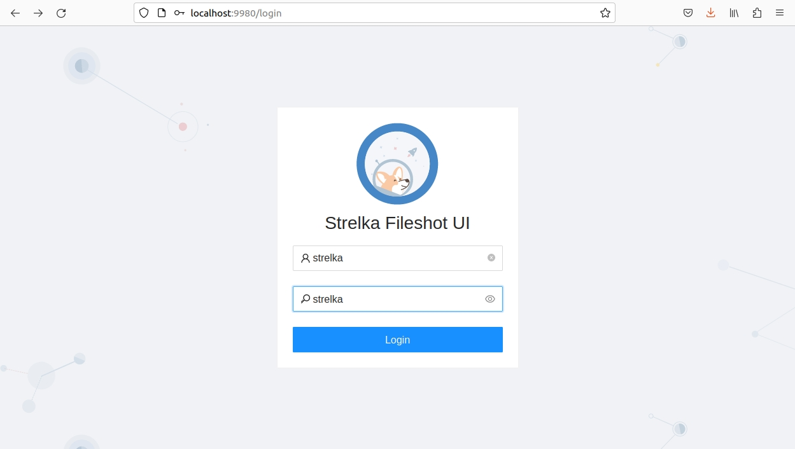
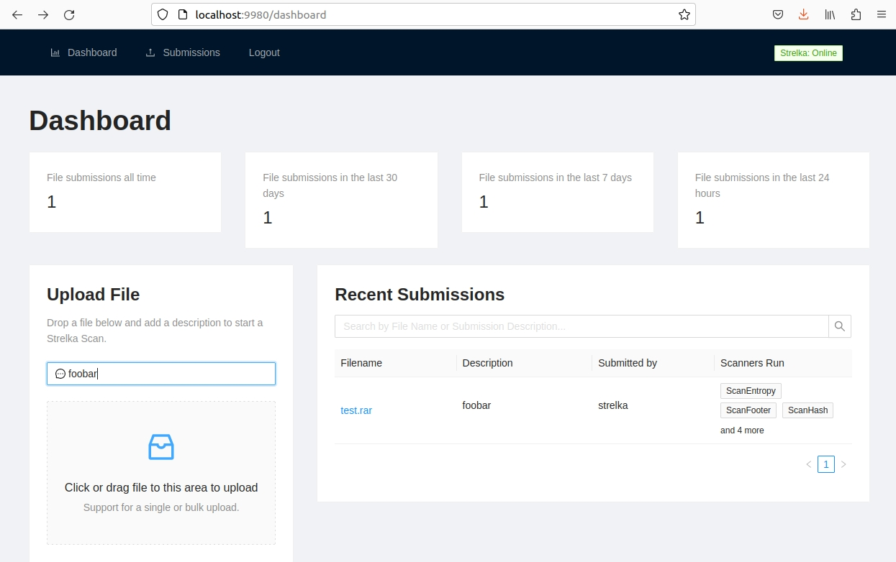

By default, Strelka is configured to use a minimal "quickstart" deployment that allows users to test the system. 
This configuration **is not recommended** for production deployments, but may suffice for environments with very low 
file volume (<50k files per day). 

Using two Terminal windows, do the following:

## Quickstart Steps
#### Step 1: Install Prerequisites

``` bash
# Ubuntu 23.04
sudo apt install -y wget git docker docker-compose golang jq && \
sudo usermod -aG docker $USER && \
newgrp docker
```

#### Step 2: Download Strelka

``` bash
git clone https://github.com/target/strelka.git && \
cd strelka
```

#### Step 3: Download and Install Preferred YARA Rules (Optional)

``` bash
rm configs/python/backend/yara/rules.yara && \
git clone https://github.com/Yara-Rules/rules.git configs/python/backend/yara/rules/ && \
echo 'include "./rules/index.yar"' > configs/python/backend/yara/rules.yara
```

#### Step 4a: Pull Precompiled Images and Start Strelka

!!! info "Strelka UI: Skip Go Build"
    You can skip the `go build` process and use the `Strelka UI` at `http://0.0.0.0:9980` to analyze files.


``` bash
docker-compose -f build/docker-compose-no-build.yaml up -d && \
go build github.com/target/strelka/src/go/cmd/strelka-oneshot
```

#### Step 4b: Build and Start Strelka

!!! info "Strelka UI: Skip Go Build"
    You can skip the `go build` process and use the `Strelka UI` at `http://0.0.0.0:9980` to analyze files.

``` bash
docker-compose -f build/docker-compose.yaml build && \
docker-compose -f build/docker-compose.yaml up -d && \
go build github.com/target/strelka/src/go/cmd/strelka-oneshot
```

#### Step 5: Prepare a File to Analyze

Use any malware sample, or other file you'd like Strelka to analyze.

``` bash
wget https://github.com/ytisf/theZoo/raw/master/malware/Binaries/Win32.Emotet/Win32.Emotet.zip -P samples/
```

#### Step 6: Analyze the File with Strelka Using the Dockerized Oneshot

``` bash
./strelka-oneshot -f samples/Win32.Emotet.zip -l - | jq
```

#### What's happening here?

1. Strelka determined that the submitted file was an encrypted ZIP (See: [backend.yaml])
2. `ScanEncryptedZip` used a dictionary to crack the ZIP file password, and extract the compressed file
3. The extracted file was sent back into the Strelka pipeline by the scanner, and Strelka determined that the extracted file was an EXE
4. `ScanPe` dissected the EXE file and added useful metadata to the output
5. `ScanYara` analyzed the EXE file, using the provided rules, and added numerous matches to the output, some indicating the file might be malicious

*The following output has been edited for brevity.*

```json
{
  "file": {
    "depth": 0,
    "flavors": {
      "mime": ["application/zip"],
      "yara": ["encrypted_zip", "zip_file"]
    },
    "scanners": [
      "ScanEncryptedZip",
      "ScanEntropy",
      "ScanFooter",
      "ScanHash",
      "ScanHeader",
      "ScanYara",
      "ScanZip"
    ]
  },
  "scan": {
    "encrypted_zip": {
      "cracked_password": "infected",
      "elapsed": 0.114269,
      "total": {"extracted": 1, "files": 1}
    }
  }
}
```
```json
{
  "file": {
    "depth": 1,
    "flavors": {
      "mime": ["application/x-dosexec"],
      "yara": ["mz_file"]
    },
    "name": "29D6161522C7F7F21B35401907C702BDDB05ED47.bin",
    "scanners": [
      "ScanEntropy",
      "ScanFooter",
      "ScanHash",
      "ScanHeader",
      "ScanPe",
      "ScanYara"
    ]
  },
  "scan": {
    "pe": {
      "address_of_entry_point": 5168,
      "base_of_code": 4096,
      "base_of_data": 32768,
      "checksum": 47465,
      "compile_time": "2015-03-31T08:53:51",
      "elapsed": 0.013076,
      "file_alignment": 4096,
      "file_info": {
        "company_name": "In CSS3",
        "file_description": "Note: In CSS3, the text-decoration property is a shorthand property for text-decoration-line, text-decoration-color, and text-decoration-style, but this is currently.",
        "file_version": "1.00.0065",
        "fixed": {"operating_systems": ["WINDOWS32"]},
        "internal_name": "Callstb",
        "original_filename": "NOFAstb.exe",
        "product_name": "Goodreads",
        "product_version": "1.00.0065",
        "var": {"character_set": "Unicode", "language": "U.S. English"}
      }
    },
    "yara": {
      "elapsed": 0.068918,
      "matches": [
        "SEH__vba",
        "SEH_Init",
        "Big_Numbers1",
        "IsPE32",
        "IsWindowsGUI",
        "HasOverlay",
        "HasRichSignature",
        "Microsoft_Visual_Basic_v50v60",
        "Microsoft_Visual_Basic_v50",
        "Microsoft_Visual_Basic_v50_v60",
        "Microsoft_Visual_Basic_v50_additional",
        "Microsoft_Visual_Basic_v50v60_additional"
      ],
      "tags": [
        "AntiDebug",
        "SEH",
        "Tactic_DefensiveEvasion",
        "Technique_AntiDebugging",
        "SubTechnique_SEH",
        "PECheck",
        "PEiD"
      ]
    }
  }
}
```

## Fileshot UI

`Strelka's UI` is available when you build the provided containers. This web interface allows you to upload files to Strelka and capture the events, which are stored locally.

Navigate to http://localhost:9980/ and use the login strelka/strelka.





